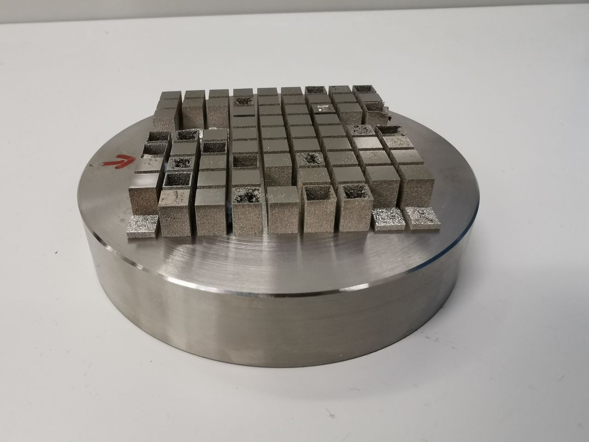
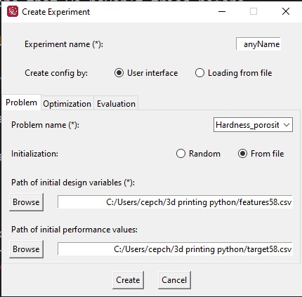

# Bayesian metal printing
Web app dedicated to metal additive manufacturing. Providing efficient process planning saving material and time resources

## Case study

In this work Multi-objective Bayesian Optimization algorithm DGEMO is used to predict the properties of material (SS 316L) based on proccess oonditions and suggest next set of parameters that would produce denser and harder sample. 

The metalic samples were printed in laboratory of additive manufactruing in Skoltech, Moscow. Each sample has unique set of process conditions that resulted in different hardness and porosity. The goal of the algorithm is to map process conditions and mechanical properties of fabricated metalic part and propose next set of conditions that we haven't tried before.

Just follow the link to Streamlit app to see the demonstration.

## Alternative way of running experiment 

1. Install [AutoOED from source](https://github.com/yunshengtian/AutoOED)

2. Upload custom problem 'Hardness_porosity.yml'  to path '..\autooed\problem\custom\yaml'

3. Open terminal and enter 'python run_gui.py'

4. Click 'create experiment'. Give it any name. Choose problem name 'hardness_porosity'. Initialization from file. Provide path to files in data folder. For design variables choose 'features58.csv' and for performance select 'target58.csv'. Finally choose DGEMO algorithm in optimization tab. That's it!

5. Observe the plots and hypervolume improvement.

